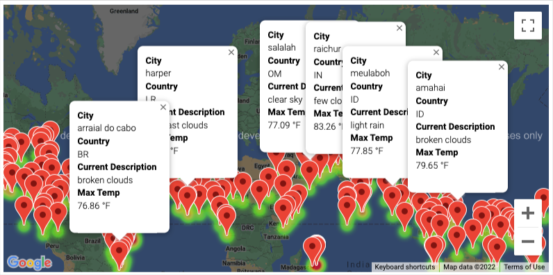
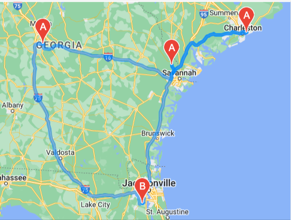

# World_Weather_Analysis
## Contents

### 1. Retrieving Wether Data (Folder: Weather_Database)

1.1  
1.2  

### 2. Creating a Customer Travel Destinations Map (Folder: Vacation_Search)

2.1  
2.2  
2.3  

### 3. Creating a Travel Itinerary Map (Folder: Vacation_Itinerary)

3.1  
3.2  
3.3  ![WeatherPy_travel_map_markers.png](Vacation_Itinerary/WeatherPy_travel_map_markers.png]
